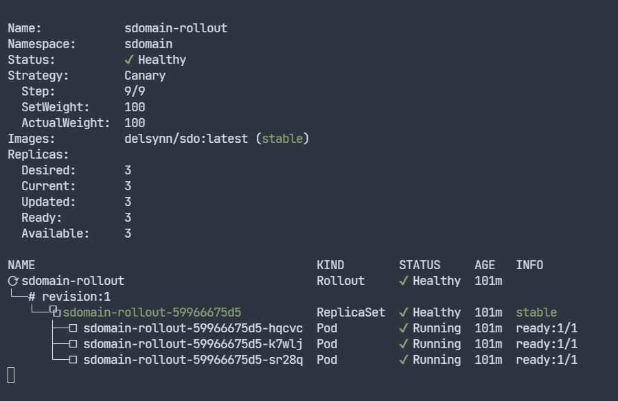

# Advanced GitOps

In de hoofdopdracht werd er ook gevraagd om nog wat andere resources te deployen:

## Argo Rollouts

Argo Rollouts is een Kubernetes controller en een set van CRDs die de mogelijkheid geven om geavanceerde deployments uit te voeren.

Het kan dan gaan over blauw-groene deployments of canary deployments.

Dit vereiste niet zoveel extra werk om werkende te krijgen maar vereise wel een extra installatie.

Hoe deze installatie moet gebeuren vonden wij terug op de officïele site van [ArgoCD](https://argo-rollouts.readthedocs.io/en/stable/installation/).

Daar wordt uitgelegd dat om de Argo Rollouts controller te installeren wij de volgende commando's moeten uitvoeren in onze cluster:

```
$ kubectl create namespace argo-rollouts
$ kubectl apply -n argo-rollouts -f https://github.com/argoproj/argo-rollouts/releases/latest/download/install.yaml
```

Hiermee creëren wij een nieuwe namespace voor Argo Rollouts waar de Argo Rollouts controller zal lopen en voeren we de installatie van deze controller uit.

Dan moeten wij een rollout en een service voor de rollout creëren, wij deden dit aan de hand van de voorbeelden op de officiële website van ArgoCD zijn "getting started" [sectie](https://argo-rollouts.readthedocs.io/en/stable/getting-started/).

Onze yamls zien er als volgt uit beginnende met de canary rollout:

```
apiVersion: argoproj.io/v1alpha1
kind: Rollout
metadata:
  name: sdomain-rollout
  namespace: sdomain
spec:
  selector:
    matchLabels:
      app: sdomain
  replicas: 3
  template:
    metadata:
      labels:
        app: sdomain
    spec:
      containers:
      - name: rollout
        image: delsynn/sdo:latest
        ports:
        - name: http
          containerPort: 8080
          protocol: TCP
        resources:
          requests:
            memory: 32Mi
            cpu: 5m
  strategy:
    canary:
      steps:
      - setWeight: 20
      - pause: {}
      - setWeight: 40
      - pause: {duration: 10}
      - setWeight: 60
      - pause: {duration: 10}
      - setWeight: 80
      - pause: {duration: 10}
      - setWeight: 100
```

En dan nog de rollout sevice:

```
apiVersion: v1
kind: Service
metadata:
  name: sdomain-rolloutservice
  namespace: sdomain
spec:
  ports:
  - port: 80
    targetPort: http
    protocol: TCP
    name: http
  selector:
    app: sdomain
```

Men kan dan best de Kubectl pluging voor Argo Rollouts installeren want hiermee kan men bijvoorbeeld in geval de canary deployment deze dan controleren en bijvoorbeeld promoveren.

Dit kan men doen door de volgende commando's uit te voeren op de cluster:

```
$ curl -LO https://github.com/argoproj/argo-rollouts/releases/latest/download/kubectl-argo-rollouts-linux-amd64
$ chmod +x ./kubectl-argo-rollouts-linux-amd64
$ sudo mv ./kubectl-argo-rollouts-linux-amd64 /usr/local/bin/kubectl-argo-rollouts
```
 Men kan nakijen of de installatie correct is uitgevoerd met het commando:

 ```
 $ kubectl argo rollouts version
```
In ons geval kunnen wij dan het volgende commando gebruiken om onze rollout te bekijken:

```
$ sudo kubectl argo rollouts get rollout sdomain-rollout -n sdomain --watch
```


Wanneer we deze rollout dan updaten met bijvoorbeeld een nieuwe image zal deze stapsgewijs de update strategie volgen.