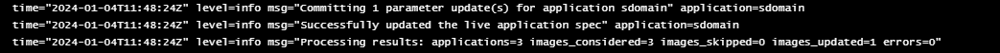
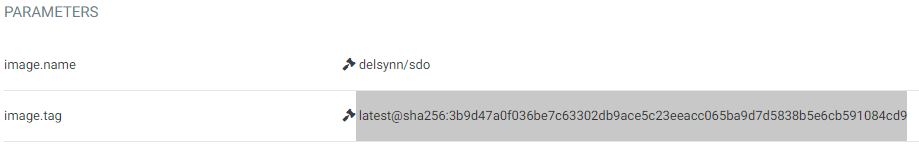

# Argo Image Updater

Nu dat wij Kustomize hebben ingesteld (met Helm niet werkend gekregen) moeten we dus Argo Image Updater installeren. Hiervoor gebruikten wij de Helm installatie die wij terugvonden op [Artifact Hub](https://artifacthub.io/packages/helm/argo/argocd-image-updater) met de volgende commando's:

 ```
$ helm repo add argo https://argoproj.github.io/argo-helm
$ helm install argocd-image-updater argo/argocd-image-updater -n argo
```

Wij hadden voordien (een vorige les) Argo ook op deze manier geïnstalleerd dus dit herinnerde ons eraan om voor de verandering eens Helm te gebruiken.

Vooraleer onze applicatie gebruik maakt van Argo Image Updater moesten wij enkele annotaties toevoegen aan onze app.yaml:

```
apiVersion: argoproj.io/v1alpha1
kind: Application
metadata:
  annotations:
    argocd-image-updater.argoproj.io/image-list: sdodev=delsynn/sdo:dev
    argocd-image-updater.argoproj.io/sdodev.update-strategy: digest
    argocd-image-updater.argoproj.io/git-branch: dev
  name: sdodev
  namespace: argo
spec:
  destination:
    namespace: sdodev
    server: https://kubernetes.default.svc
  project: default
  source:
    repoURL: https://github.com/Cloud-Computing-2324/evaluation-smoothdevoperators.git
    path: overlays/dev
    targetRevision: dev
  info:
    - name: 'sdodev'
      value: 'https://sdodev.38.cc.ucll.cloud'
```
Zoals men kan zien geeft het een alias aan de locatie van onze Docker Image repository, deze gebruiken we dan in de volgende annotatie om de manier van updaten in te stellen. En ten slot zeggen we nog over welke branch het gaat in onze repository alhoewel dit technisch niet nodig is.

Met deze annotaties konden we zien in de image updater pod dat onze applicaties om de twee minuten worden nagekeken of zij up-to-date zijn met de Docker Hub repository:



Zoals u kan zien wordt ook onze main branch gemonitored en geüpdate (zoals u kan zien in de parameters van de applicatie) maar niet toegepast op de containers:



We moeten deze applicatie verwijderen en terug toepassen vooraleer deze zijn containers zal updaten.

