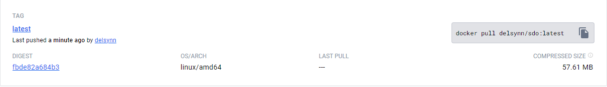

# Docker & MdBook

We beginnen bij het aanmaken van een docker image van onze website.
Tijdens het werken aan de documentatie van andere opdrachten kwam ik op een video over het gebruik van een Github Action genaamd MdBook.

Deze action maakt een statisch website uit uw markdown files, wat het aanmaken van een documentatie website enorm versimpeld.

Hier zitten we dus al gedeeltelijk bij het gebruik van een workflow. 
Bijvoorbeeld voor de main branch van onze repository hebben we de volgende workflow aangemaakt:

```
name: Build Main

on:
  push:
    branches:
      - main

jobs:
  build:
    runs-on: ubuntu-latest
    
    steps:
      - name: Checkout code
        uses: actions/checkout@v4  

      - name: Setup mdBook
        uses: peaceiris/actions-mdbook@v1
        with:
          mdbook-version: 'latest'
          # mdbook-version: '0.4.10'

      - run: mdbook build

      - name: Docker login
        env:
          DOCKER_HUB_LOGIN: ${{ secrets.DOCKER_HUB_LOGIN }}
          DOCKER_HUB_SECRET: ${{ secrets.DOCKER_HUB_SECRET }}
        run: |
          echo 'Docker login'
          docker login -u $DOCKER_HUB_LOGIN -p $DOCKER_HUB_SECRET

      - name: Build and push Docker image
        run: |
          echo 'Running build...'
          docker build --no-cache ./book -t delsynn/sdo:latest
          echo 'Pushing image...'
          docker push delsynn/sdo:latest
          echo 'Done !'

```

Zoals u kan zien maakt deze workflow gebruik van enkele Github Actions namelijk:

- De checkout action: deze gaat de repository kopiëren naar de workspace van de workflow en zal aan het einde van de workflow ook alles terug opkuisen.
- De mdbook action: deze maakt een statische website, zoals u dus ziet, van de markdown files die zich in de "src" folder bevinden in onze repository.
- En als laatste maken we twee stappen zelf aan waar we inloggen op docker, een image aanmaken van de resulterende files van de mdbook action en deze opladen op Michiel's Docker Hub.

Nu hebben we een image op docker hub waarmee wij kunnen werken voor het deployen van onze website.



