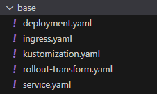
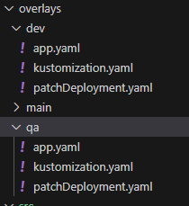
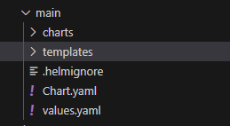
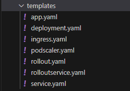

# Kustomize and Helm voor Argo Image Updater

Toen we wat verder in de opdracht kwamen stootten wij op het probleem dat onze docker images niet updaten wanneer wij de repository pushen met aanpassingen aan de website. Tiebe kwam op het idee om met Argo Image Updater te werken maar bij onderzoek bleek dat deze add-on voor Argo enkel werkt in samenwerking met het gebruik van Kustomize of Helm. Daarom hebben wij op de dev en qa branch gebruik gemaakt van Kustomize en Helm op de main branch.

## Kustomize

Voor Kustomize hebben wij een folder opbouw waarbij we een base folder hebben waarim de templates zitten voor de resources die we deployen op alle branches, dus deployment, service en ingress. Alsook een kustomization yaml waarin we naar deze templates gaan wijzen als resources:



```
apiVersion: kustomize.config.k8s.io/v1beta1
kind: Kustomization

configurations:
- rollout-transform.yaml

resources:
- deployment.yaml
- ingress.yaml
- service.yaml
```

Dan een overlays folder (bijvoorbeeld overlays/dev) waarin wij een ook een kustomization yaml hebben die gaat wijzen naar de base folder en naar de yaml waarin de deployment zit. Dit kan met meerdere yamls maar wij hebben gekozen om alle resources in een enkele yaml te steken (patchDeployment.yaml):



```
apiVersion: kustomize.config.k8s.io/v1beta1
kind: Kustomization

nameSuffix: dev

resources:
- ../../base

patchesStrategicMerge:
  - patchDeployment.yaml
```

```
apiVersion: apps/v1
kind: Deployment
metadata:
  name: sdo
spec:
  replicas: 1
  selector:
    matchLabels:
      app: sdodev
  template:
    metadata:
      labels:
        app: sdodev
    spec:
      containers:
      - name: sdowebsite
        image: delsynn/sdo:dev
        resources:
          requests:
            memory: "128Mi"
            cpu: "50m"

---

apiVersion: networking.k8s.io/v1
kind: Ingress
metadata:
  name: sdo
spec:
  rules:
  - host: sdodev.38.cc.ucll.cloud
    http:
      paths:
      - path: /
        pathType: Prefix
        backend:
          service:
            name: sdo
            port:
              number: 80

---

apiVersion: v1
kind: Service
metadata:
  name: sdo
spec:
  selector:
    app: sdodev
```

De kustomization van de overlay gaat dus naar de bases folder kijken om daar zijn templates te halen en gaat ook zeggen wat er moet veranderd worden in zijn eigen deployment (in dit geval nameSuffix).
Wij hebben maar de basis uitgevoerd met zowel Kustomize en Helm. Gewoon om image updater werkende te krijgen. Dus men kan hier nog veel verder in gaan.

Voor Helm hebben we in de overlays folder "helm create main" gedaan zodat we een helm applicatie aanmaken voor de "main" applicatie. Deze folder structuur ziet er als volgt uit:



In de charts folders kan men andere helm charts waar de applicatie afhankelijk van is (dependencies). Hier zit momenteel niets in bij ons. 

En in de templates folders zitten de resources die men wilt deployen:



Zoals men kan zien zitten hier de extra yamls in die wij enkel op de main branch hebben gedeployed zoals de rollout/rolloutservice en de podscaler.

Een voorbeeld van één van deze resources:

```
apiVersion: apps/v1
kind: Deployment
metadata:
  name: {{ .Values.appName }}
  namespace: {{ .Values.namespace }}
spec:
  replicas: 0
  selector:
    matchLabels:
      app: {{ .Values.appName }}
  template:
    metadata:
      labels:
        app: {{ .Values.appName }}
    spec:
      containers:
      - image: delsynn/sdo:latest
        imagePullPolicy: Always
        name: sdowebsite
        ports:
        - containerPort: 80
        resources:
          requests:
            memory: "128Mi"
            cpu: "50m"
```

Helm werkt met values. Men kan bijvoorbeeld naam een template value geven die men dan in de values.yaml file gaat steken:

```
appName: sdomain
namespace: sdomain
```
Bij het deployen vanuit de main folder met commando:

```
$ helm install main . --values values.yaml
```
Gaat Helm alle templates deployen en de values in deze templates invullen met de values die meegegeven worden met de values yaml. 

Het enige dat wij dan moeten doen om dit aan te passen voor andere branches is een andere values.yaml aanmaken waarin wij de values aanpassen naar wat nodig is voor die branch (bijvoorbeeld sdodev voor de naam).

De naam "main" voor de applicatie was misschien geen goede keuze maar we waren niet van plan Helm te gebruiken op de andere branches.

Dit omdat de werking met Argo Image Updater voor Helm ons nog moeilijkheden geeft en wij zijn er niet in geslaagd om dit werkende te krijgen. De image wordt geüpdate en er wordt een hash voor gemaakt maar dit wordt dan niet toegepast op de containers. Helaas hebben wij dit niet op tijd kunnen oplossen.