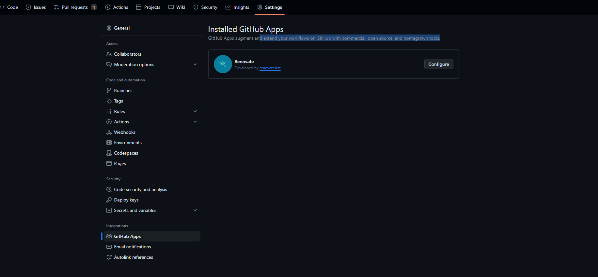
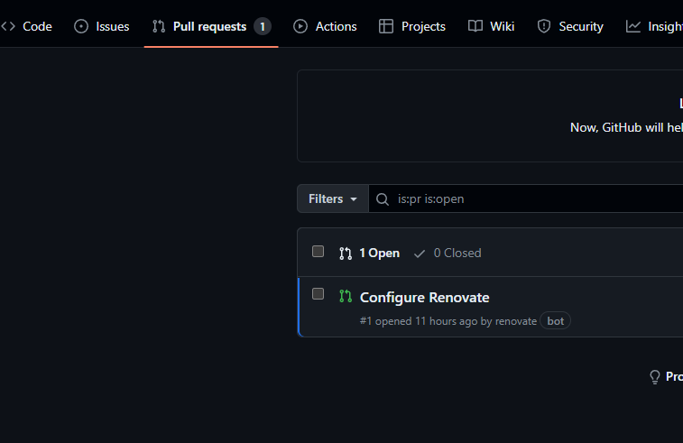
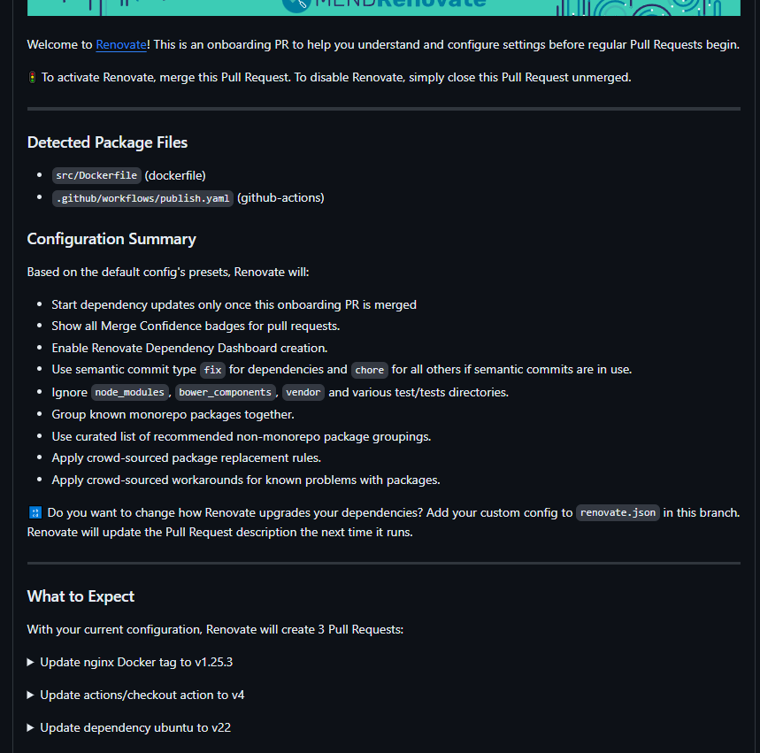
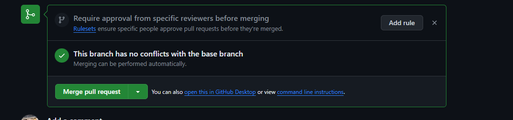
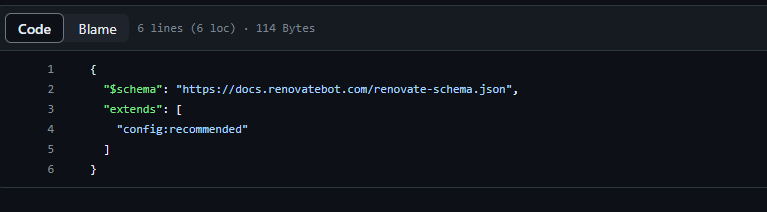
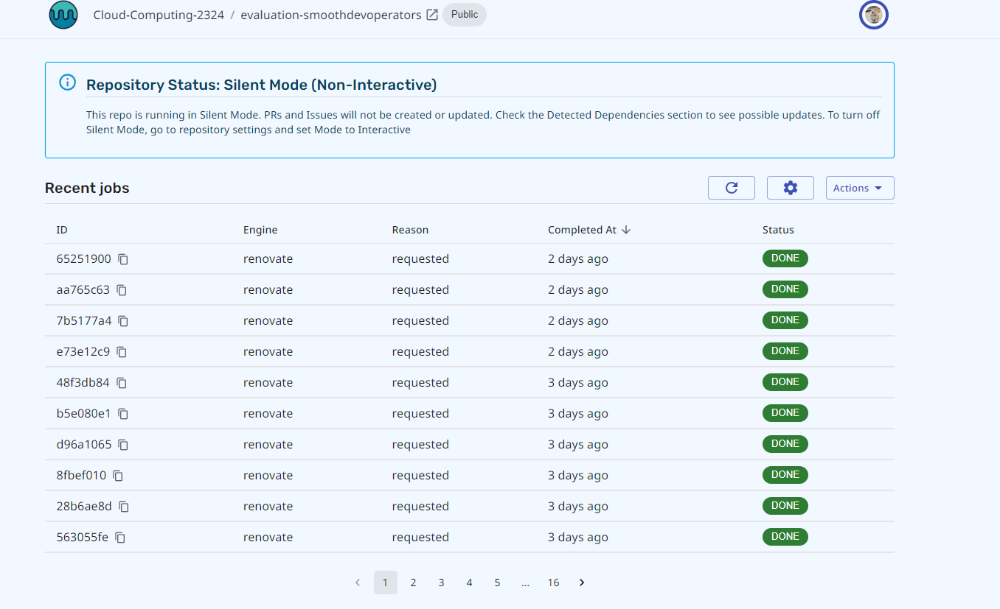

# Renovatebot

De installatie van renovatebot ging vrij simpel.

Men gaat naar de settings in de repository.

Daar kan men dan Renovate als app kiezen, hierna zal Renovate zelf een pull request maken voor de configuratie van zichzelf.

Wanneer men deze pull request dan bekijkt zal er in uitgelegd staan welke dependancies in uw repository Renovate dan zal monitoren en hoe frequent het dit zal doen.

Wanneer men deze pull request dan merged zal de configuratiefile voor renovate worden aangemaakt in de root van de repository. Vanaf dan zal Renovatebot de dependancies in de repository gaan monitoren met de frequentie die is ingesteld (standaard om de 2 uur).

Men kan ook de developer dashboard van Renovate gebruiken op de [mend.io website](https://developer.mend.io/). Hier zal men dan een oplijsting zien van alle "Renovates" dat er gebeurd zijn op de repository.

