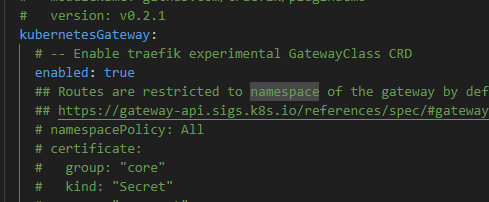
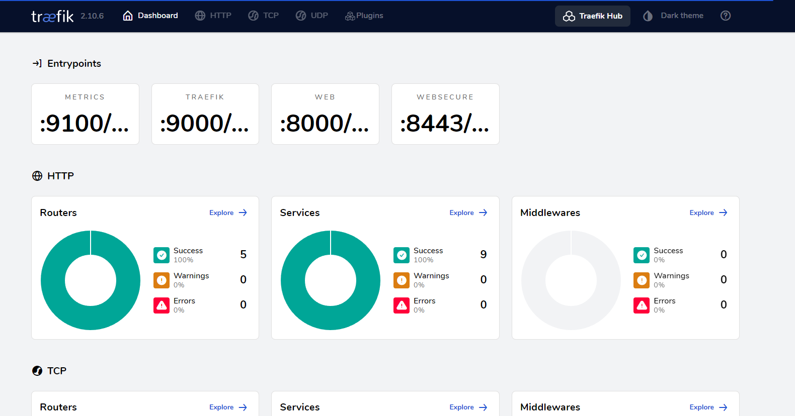
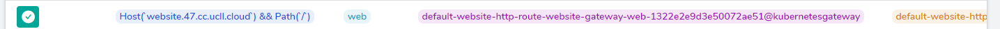

# Gateway API Spec

## Instellen van een HTTP Route

Voor de Kubernetes Gateway API gebruikten wij de officiële documentatie op de volgende [website](https://gateway-api.sigs.k8s.io/guides/) en voor de gateway controller gebruikten we Traefik die we terugvonden op de officiële [Traefik website](https://doc.traefik.io/traefik/getting-started/install-traefik/).

Voor installatie, wat we van de Kubernetes Gateway API website moeten uitvoeren is de installatie van het experimentele kanaal met het volgende commando:

```
$ kubectl apply -f https://github.com/kubernetes-sigs/gateway-api/releases/download/v1.0.0/experimental-install.yaml
```

Zij vertellen ons ook dat wij een Gateway Controller moeten installeren en hiervoor kozen wij Traefik.
De installatie hiervan is wat ingewikkelder.

We kunnen de installatie uitvoeren met een Helm chart, hier moeten we echter best de values.yaml file van Traefik zelf aan toevoegen en het gebruik van het experimentele kanaal aanzetten in deze values file:



Na deze values file aan te passen en op te slagen kunnen wij dan overgaan tot de installatie van de helm chart met de volgende commando's:

```
$ helm repo add traefik https://traefik.github.io/charts
$ helm repo update
$ helm install traefik traefik/traefik --version 26.0.0 -n traefik --values values.yaml
```
De namespace "traefik" hadden wij al op voorhand aangemaakt.

Indien men dan wil gebruik maken van het Traefik Dashboard kan men de pod port forwarden met het volgende commando:

```
$ kubectl port-forward -n traefik traefik-54cb9c5568-p26ff 9000:9000
```
Hierna kunnen wij het dashboard bereiken op http://localhost:9000 :



Wanneer wij een http route aanmaken zal deze hier verschijnen en kunnen gemonitored worden, zoals die van de simpele website die ik voor dit onderdeel heb aangemaakt:



Maar de installatieprocedure voor Traefik is nog niet afgelopen.

We moeten nog 3 dingen toevoegen aan onze setup namelijk
- de Kubernetes Gateway API definitions
- de RBAC voor de Traefik custom resources
- en de nodige Gateway API resources, in ons geval een gateway.yaml en een httproute.yaml

Alle 3 deze configuraties kan men terugvinden op de volgende pagina van de [Traefik website](https://doc.traefik.io/traefik/reference/dynamic-configuration/kubernetes-gateway/).

We voegen deze toe aan onze cluster met het commando:

```
$ kubectl apply -f "definitions.yaml"
$ kubectl apply -f "rbac.yaml"
```

Hierna is het enige dat wij nog moeten doen is dus een yaml aanmaken voor de nodige resources. Voor een simpele http route zijn dat een gateway:

```
apiVersion: gateway.networking.k8s.io/v1alpha2
kind: Gateway
metadata:
  name: website-gateway
  namespace: default
spec:
  gatewayClassName: traefik
  listeners:
  - name: web
    port: 8000
    protocol: HTTP
    allowedRoutes:
      namespaces:
        from: All
```
En de HTTP Route:

```
apiVersion: gateway.networking.k8s.io/v1alpha2
kind: HTTPRoute
metadata:
  name: website-http-route
  namespace: default
spec:
  parentRefs:
    - name: website-gateway
  hostnames:
    - "website.47.cc.ucll.cloud"  # Replace with your domain
  rules:
    - matches:
        - path:
            type: Exact
            value: /
      backendRefs:
        - name: website-service
          port: 80
```
We hebben dan nog wel geen website lopende dus hiervoor maken wij ook een deployment en service:

```
apiVersion: apps/v1
kind: Deployment
metadata:
  name: website
spec:
  replicas: 1
  selector:
    matchLabels:
      app: website
  template:
    metadata:
      labels:
        app: website
    spec:
      containers:
      - name: website
        image: delsynn/website:1.7
        imagePullPolicy: Always
        ports:
        - containerPort: 80
```

```
apiVersion: v1
kind: Service
metadata:
  name: website-service
spec:
  selector:
    app: website
  ports:
    - protocol: TCP
      port: 80
      targetPort: 80
```

Al deze resources voeren wij ook uit met de commando's:

```
$ kubectl apply -f websiteGateway.yaml
$ kubectl apply -f websiteHttpRoute.yaml
$ kubectl apply -f websiteDeployment.yaml
$ kubectl apply -f websiteService.yaml
```

Nu is onze website bereikbaar op [http://website.47.cc.ucll.cloud]([http://website.47.cc.ucll.cloud):


SUCCES !