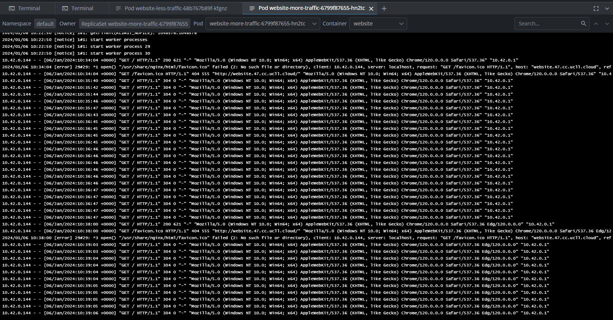
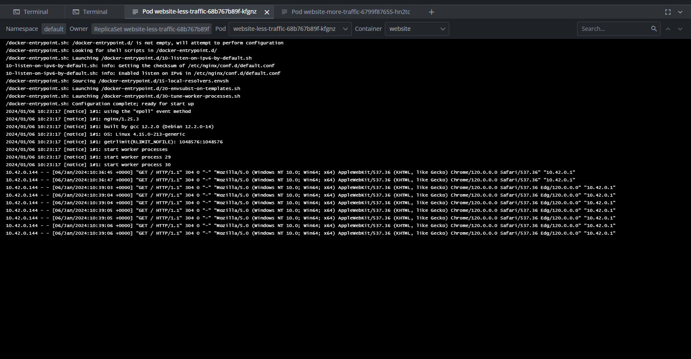

# HTTP Route Load Balancing

Nu om deze route als load balancer in te stellen moeten er twee dingen gedaan worden:
- Natuurlijk een tweede deployment creeëren van de website zodat er tussen deze twee deployments kan gebalanced worden.
- En de HTTPRoute zo aanpassen dat deze zal load balancen.

Wij hebben dus de benamingen van de deployments heel duidelijk gemaakt zoals u hieronder kan zien.

## More Traffic Website:

```
apiVersion: apps/v1
kind: Deployment
metadata:
  name: website-more-traffic
spec:
  replicas: 1
  selector:
    matchLabels:
      app: website-more-traffic
  template:
    metadata:
      labels:
        app: website-more-traffic
    spec:
      containers:
      - name: website
        image: delsynn/website:1.7
        imagePullPolicy: Always
        ports:
        - containerPort: 80
```
```
apiVersion: v1
kind: Service
metadata:
  name: website-more-traffic
spec:
  selector:
    app: website-more-traffic
  ports:
    - protocol: TCP
      port: 80
      targetPort: 80
```
## Less Traffic Website:

```
apiVersion: apps/v1
kind: Deployment
metadata:
  name: website-less-traffic
spec:
  replicas: 1
  selector:
    matchLabels:
      app: website-less-traffic
  template:
    metadata:
      labels:
        app: website-less-traffic
    spec:
      containers:
      - name: website
        image: delsynn/website:1.7
        imagePullPolicy: Always
        ports:
        - containerPort: 80
```
```
apiVersion: v1
kind: Service
metadata:
  name: website-less-traffic
spec:
  selector:
    app: website-less-traffic
  ports:
    - protocol: TCP
      port: 80
      targetPort: 80
```

## Aangepaste HTTPRoute:

```
apiVersion: gateway.networking.k8s.io/v1alpha2
kind: HTTPRoute
metadata:
  name: website-http-route
  namespace: default
spec:
  parentRefs:
    - name: website-gateway
  hostnames:
    - "website.47.cc.ucll.cloud"  # Replace with your domain
  rules:
    - backendRefs:
      - name: website-more-traffic
        port: 80
        weight: 70
      - name: website-less-traffic
        port: 80
        weight: 30
```

Door het toekennen van een "weight" zal er bepaald worden welke deployment het meeste trafiek zal ontvangen. 

Zoals u hier kan zien zal 70% van de trafiek worden doorgestuurd naar de service van website-more-traffic en deze zal de trafiek dan doorsturen naar de website-more-traffic deployment.

En 30% gaat dus naar de service van website-less-traffic die deze dan ook doorstuurt naar de website-less traffic deployment.

## Visualisatie in lens

Hieronder zal u de logs van beide pods kunnen zien en u zal zien dat inderdaad de website-less-traffic veel minder trafiek krijgt dan website-more-traffic pod.

### website-more-traffic pod:

### website-less-traffic pod:
