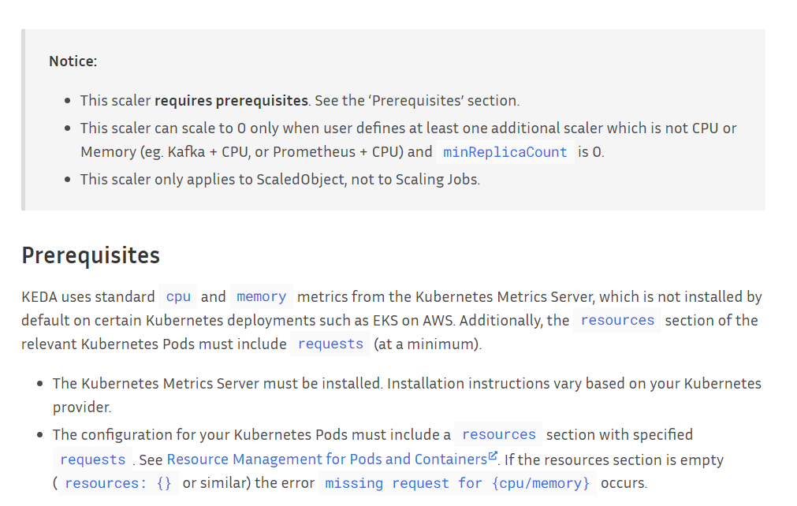
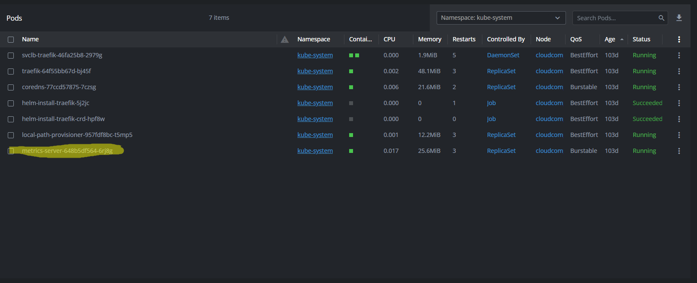
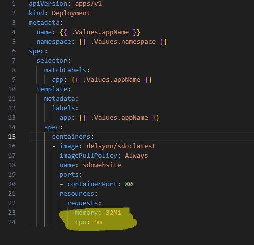

# Keda CPU-Scaler

Volgens de officiële website van Keda heeft de cpu scaler enkele vereisten:

Zoals men kan zien heeft deze scaler de Kubernetes Metrics Server nodig vooraleer deze kan werken, gelukkige was deze al standaard geïnstalleerd op onze cluster:

De tweede vereiste is dat onze deployments wel degelijk resources hebben die kunnen gemonitored worden door deze scaler, zoals u kan zien in onze deployment yaml, zijn deze ook aanwezig:

We hebben vrij weinig resources toegekent per pod aangezien het over een simpele website als deze gaat en enkel wij momenteel de website bezoeken.