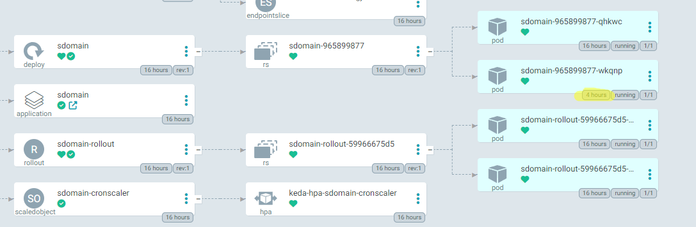

# Keda Cronscaler

We hebben voor de main branch ook Keda geïnstalleerd, dit is een autoscaler die meer pods gaat genereren van onze applicatie aan de hand van bepaalde triggers.

Voor Keda te installeren maakten wij weer gebruik van de Helm chart die we terugvonden op [Artifact Hub](https://artifacthub.io/packages/helm/kedacore/keda) met de volgende commando's:

```
$ helm repo add kedacore https://kedacore.github.io/charts
$ helm repo update

$ kubectl create namespace keda
$ helm install keda kedacore/keda --namespace keda --version 2.12.0
```

Wij hebben gekozen voor een simpele podscaler aan de hand van een cron schedule zoals men hieronder kan zien:

```
apiVersion: keda.sh/v1alpha1
kind: ScaledObject
metadata:
  name: sdomain-podscaler
  namespace: sdomain
spec:
  scaleTargetRef:
    name: sdomain
  triggers:
  - type: cron
    metadata:
      timezone: Europe/Brussels
      start: 0 8 * * *
      end: 0 20 * * *
      desiredReplicas: "2"
```
Zoals u kan zien zal deze 2 replicas aanmaken van onze pods tussen 8 en 20 uur en dit dan weer terugscalen naar de originele hoeveelheid. Dit kan gebruikt worden om extra pods aan te maken tijdens de drukkere uren om de grotere hoeveelheid van trafiek aan te kunnen.

Dit was voldoende om de Keda cronscaler te doen werken.

De screenshot hieronder werd genomen om 12 uur en u ziet dat er 4 uur geleden een nieuwe pod werd aangemaakt om aan de cronscaler te voldoen, deze zal dan ook weer verdwijnen om 20:00 uur:

