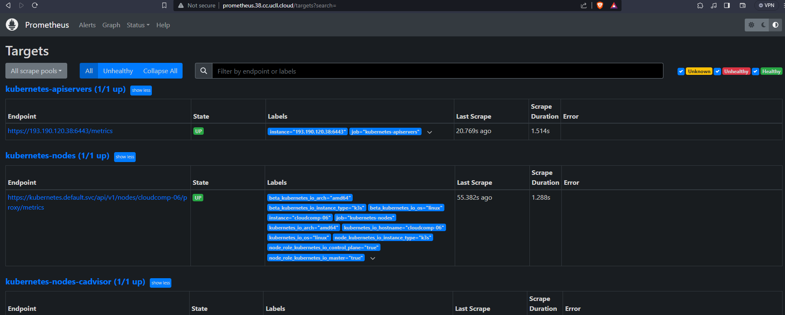
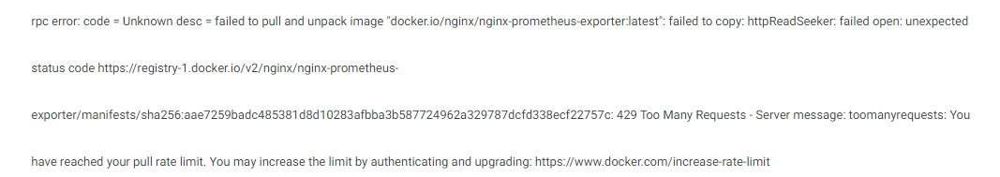

# Prometheus en metrics scaler

Tot slot was er nog de extra opdracht om een scaler te maken op basis van een metric die Prometheus scraped.

We waren hieraan begonnen en hadden een Helm installatie gedaan van Prometheus met de commando's:

```
$ helm repo add prometheus-community https://prometheus-community.github.io/helm-charts
$ helm install prometheus prometheus-community/prometheus --values values.yaml
```
Met een simpele values.yaml voor de helm installatie van Prometheus:

```
server:
  ingress:
    enabled: true
    hosts:
      - prometheus.38.cc.ucll.cloud
  persistentVolume:
    enabled: false

additionalScrapeConfigs:
  - job_name: 'nginx-exporter'
    static_configs:
      - targets: ['sdoqa.sdoqa.svc.cluster.local:9113']
```

Hierna was het dashboard van Prometheus al bereikbaar op prometheus.38.cc.ucll.cloud:



We deden dan een deployment met een image van onze website en een image van nginx node exporter voor prometheus:

```
apiVersion: apps/v1
kind: Deployment
metadata:
  name: sdo
spec:
  replicas: 1
  selector:
    matchLabels:
      app: sdoqa
  template:
    metadata:
      labels:
        app: sdoqa
      annotations:
        prometheus.io/scrape: 'true'
        prometheus.io/port: '9113'
    spec:
      containers:
      - name: sdowebsite
        image: delsynn/sdo:qa
        resources:
          requests:
            memory: 32Mi
            cpu: 5m
      - name: nginx-exporter
          image: 'nginx/nginx-prometheus-exporter:0.10.0'
          args:
            - '-nginx.scrape-uri=http://localhost/nginx_status'
          resources:
            limits:
              memory: 128Mi
              cpu: 50m
          ports:
            - containerPort: 9113
```
Dit zou een pod opstarten met zowel een container van onze website en een container met de nginx exporter.

We stuitten echter op het probleem dat wij teveel pull requests aan het uitvoeren waren op docker hub:



Hierdoor startte de pod niet op en konden wij ook niet verder met testen.

Aangezien dit redelijk dicht aan het einde van de vakantie was hebben we dit dus niet meer kunnen oplossen.

